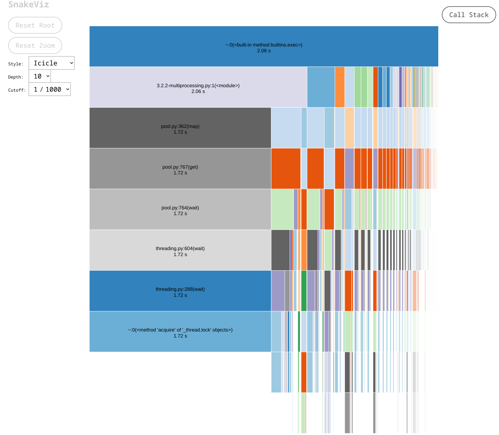
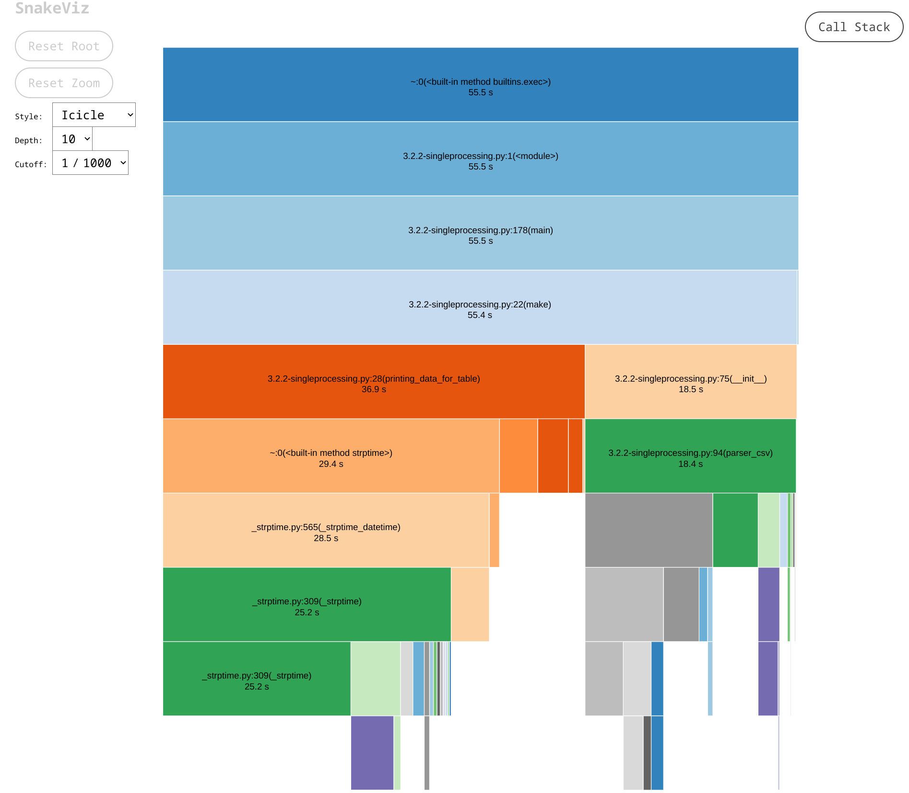

# 3.2.1

Разделенный файлики создаются в директории Separated csv

# 3.2.2

```python
pip install snakeviz
python -m cProfile -o single.prof 3.2.2-singleprocessing.py
python -m cProfile -o multi.prof 3.2.2-multiprocessing.py  
snakeviz single.prof
snakeviz multi.prof
```

## Результаты

### multiprocessing


### singleprocessing
